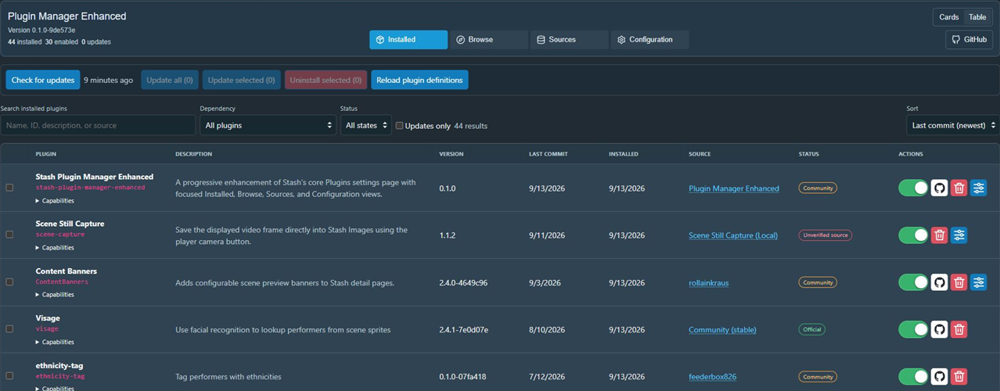
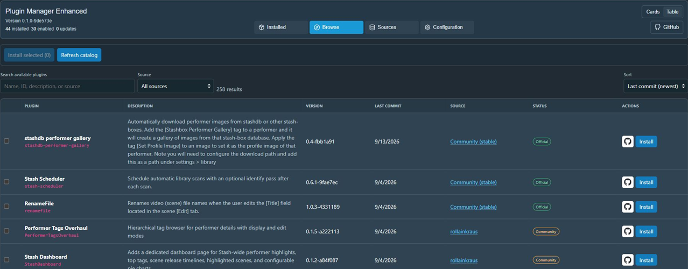

# Stash Plugin Manager Enhanced

A client-side Stash UI plugin that enhances **Settings → Plugins** in place with a wider, accessible interface while leaving Stash core unchanged.





## Installation

1. Open **Settings → Plugins** in Stash.
2. Under **Available Plugins**, add a package source (or use **Sources → Add source** if this enhancement is already installed):
   - Name: `RyanAtNight`
   - Source URL: `https://ryanatnight.github.io/stash-plugin-manager-enhanced/index.yml`
   - Local path: `ryanatnight`
3. Reload the available packages, select **Stash Plugin Manager Enhanced**, and install it.
4. Reload plugins if prompted, then refresh your browser.

Updates are delivered through Stash's normal plugin update controls. Install from one source only; remove a manually installed copy before switching to a managed installation to avoid duplicate plugin IDs.

For manual installation, download the plugin ZIP from [Releases](https://github.com/RyanAtNight/stash-plugin-manager-enhanced/releases/latest) and extract it into its own folder beneath Stash's `plugins` directory. Use the plugin ZIP, not GitHub's source-code archives. Reload plugins and refresh the browser.

Report problems through [GitHub Issues](https://github.com/RyanAtNight/stash-plugin-manager-enhanced/issues), including your Stash version, browser, and reproduction steps. Remove API keys and private URLs from reports.

## Why this is possible

Stash UI plugins may load JavaScript and CSS globally. This plugin watches Stash SPA navigation for `/settings?tab=plugins`, hides the three stock plugin sections, mounts the enhanced interface, and restores the stock sections when navigating away or when the enhancement is dismissed.

The integration is intentionally progressive because Stash's `SettingsPluginsPanel` is not currently exposed as a named patchable component. The plugin only hides the original stock sections while the enhanced interface is active and restores them if you disable the enhancement. Stash's UI plugin API is experimental, so DOM integration may need adjustment after future Stash UI changes.

## Features

### Highlights

- Manage installed plugins, discover new ones, maintain sources, and edit configuration from one focused interface
- Switch between responsive **Cards** and information-dense **Table** presentations
- Find plugins quickly with search, sorting, filters, source links, and clear status counts
- Install, update, and uninstall plugins individually or in bulk; enable, disable, and configure plugins one at a time
- Inspect source health, trust, package coverage, update status, commit dates, and GitHub repositories
- Keep your place through refreshes and browser Back/Forward with URL-addressable tabs and source links

### Advanced and detailed features

Compared with Stash's stock Plugins page, the enhanced interface adds:

- Separate **Installed**, **Browse**, **Sources**, and **Configuration** views
- Browse renders 50 packages initially with progressive **Load more** controls
- Responsive, wider Cards and Table layouts with full plugin descriptions
- Search by name, ID, description, version, and source
- Search updates after a 250 ms typing pause, preserving the search field and cursor during typing and held Backspace
- Per-plugin last-commit dates with name, newest-commit, or oldest-commit sorting
- Filter plugins for enabled, disabled, source, and updates-only
- Remember the Installed Status, Sort, and Cards/Table preferences between visits
- Visible installed/enabled/update counts
- Individual and bulk installation, updating, and uninstalling
- Runtime-only plugins appear when present (unlike the stock UI), with enable/disable controls and package operations disabled for safety
- Source health, package counts, trust labels, last-check time, and repository-root GitHub links
- Add, edit, and delete package sources directly from the Sources view
- Installed and Browse source labels link to stable, URL-addressable cards in **Sources**, including refresh and browser-history restoration
- Collapsible plugin configuration page with expand/collapse all
- Explicit hook names and trigger events
- Manifest-derived capability summaries
- Accessible selection labels and contextual search labels
- Operation feedback, package-job completion polling, and destructive confirmations
- Clickable GitHub links for installed and available plugins

## GitHub URL resolution

Repository buttons open in a new tab with `noopener noreferrer`. Resolution order:

1. Loaded plugin `url`
2. Package metadata keys such as `repository`, `repository_url`, `repo`, `github`, `homepage`, or `url`
3. Conventional GitHub Pages package indexes

For example:

```text
https://stashapp.github.io/CommunityScripts/stable/index.yml
```

and package `VideoScrollWheel` resolve to:

```text
https://github.com/stashapp/CommunityScripts/tree/stable/plugins/VideoScrollWheel
```

If no defensible GitHub URL can be found, the UI displays **Repository unavailable** rather than guessing.

## License

Copyright (C) 2026 RyanAtNight.

This project is licensed under the GNU Affero General Public License,
version 3 only (`AGPL-3.0-only`). See [LICENSE](LICENSE) for the full terms.

## Development

```bash
npm install
npm test
npm run build
npm run check
```

The packaged plugin is written to `dist/`.

## Local installation

Copy the files in `dist/`, including `LICENSE`, to a directory beneath the Stash configuration's `plugins` directory, then choose **Reload plugins** in Stash or restart Stash.

For this development checkout, run `npm run deploy:local`. It rebuilds the plugin, copies the generated files to the authoritative local Stash plugin directory, registers its package source and uninstall manifest, verifies Stash's `reloadPlugins` response, and then emits a visible Windows toast and notification sound. The package manifest keeps the manager in Stash's stock **Installed Plugins** list, with the normal uninstall control, when **Enhanced Plugins UI** is turned off. The notification is deliberately sent only after deployment and reload have succeeded.

Expected layout:

```text
plugins/
└── stash-plugin-manager-enhanced/
    ├── LICENSE
    ├── stash-plugin-manager-enhanced.yml
    ├── stash-plugin-manager-enhanced.js
    └── stash-plugin-manager-enhanced.css
```

## Honest client-side limitations

Stash does not currently expose enough package metadata to implement every desirable package-manager feature safely:

- **Rollback:** package history and previous archives are not exposed.
- **Compatibility ranges:** plugin manifests do not declare a supported Stash version range.
- **Permissions:** filesystem and network permissions are not declared by manifests.
- **Setting defaults/effective values:** manifests expose type and description but not machine-readable universal defaults or validation ranges. The UI therefore leaves absent numeric values blank and omits them when saved; it does not parse prose descriptions and guess defaults.
- **Cryptographic publisher identity:** indexes provide package hashes, but Stash does not expose a signed publisher identity to the UI.

The interface states these limitations instead of inferring potentially misleading values. Official/community labels describe the package **source**, not a security audit of the plugin.

## Security model

- GraphQL requests are same-origin and use the active Stash session.
- Package/source strings are HTML-escaped before rendering.
- Only HTTP(S) package-source URLs become clickable links; unsafe schemes are displayed as text and rejected by the source form.
- External links use `noopener noreferrer`.
- Non-GitHub source URLs are never converted into invented GitHub links.
- Destructive operations require confirmation.

## Status

Release version: `0.1.0`. Live development testing used **Stash v0.31.1** (`4de2351e`). Other Stash versions and custom themes have not been exhaustively tested.

## Publishing updates

Keep the versions in `package.json`, `package-lock.json`, and the plugin manifest aligned. Add release notes at `docs/releases/vVERSION.md`, run `npm run check`, then push a matching `vVERSION` tag. The release workflow tests and packages the plugin, publishes the source index to GitHub Pages, and creates a GitHub release with the same ZIP and checksum.

To inspect the package locally after building, run `python scripts/package-release.py`. Output is written to `_site/`. Python is required only for release packaging; plugin users do not need Node.js or Python.
